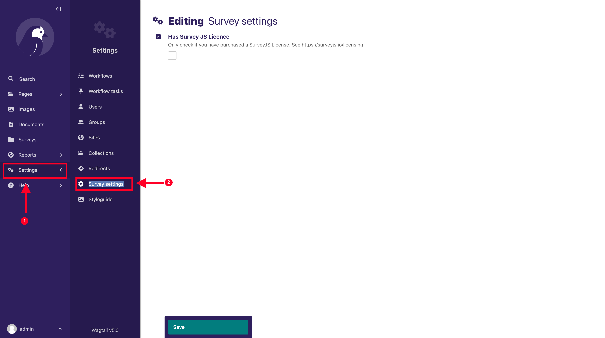
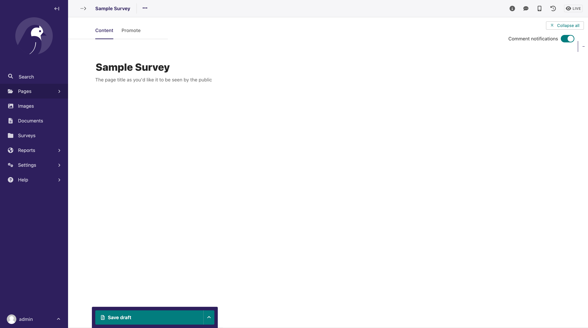
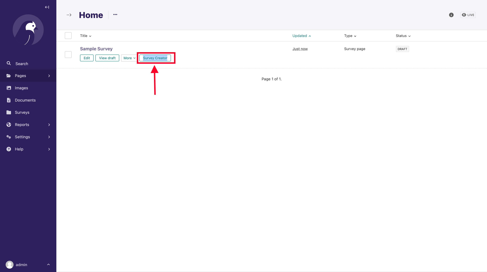
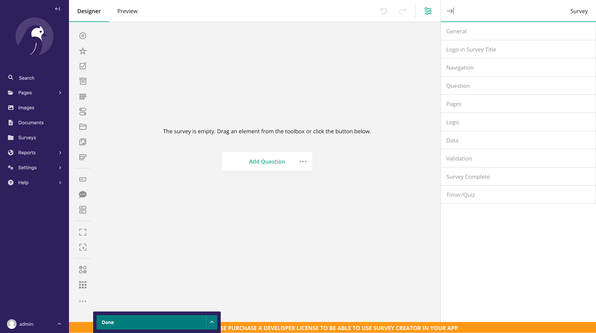
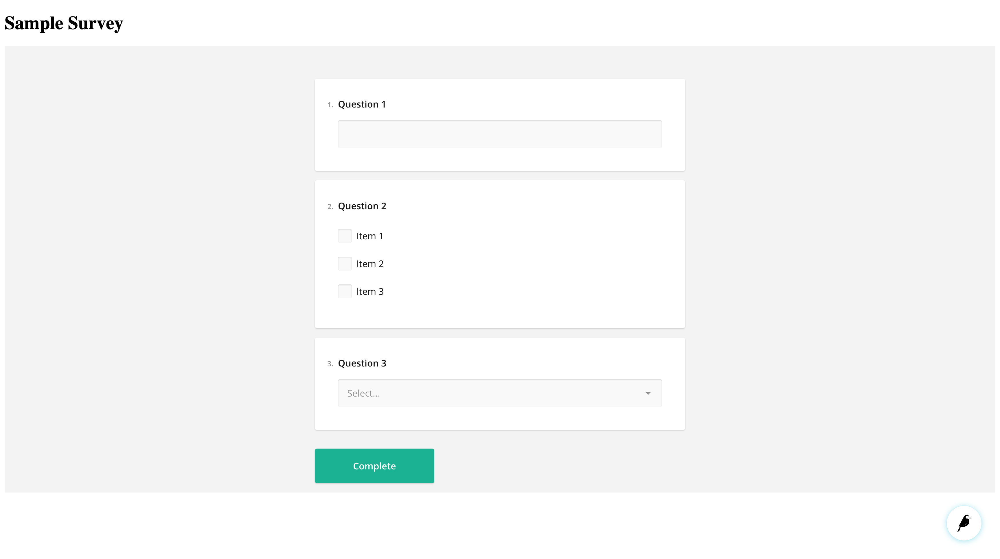
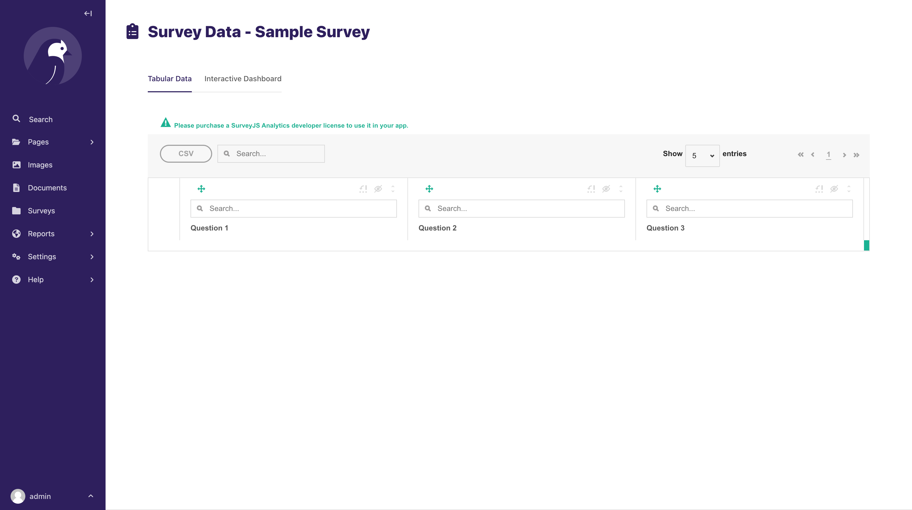
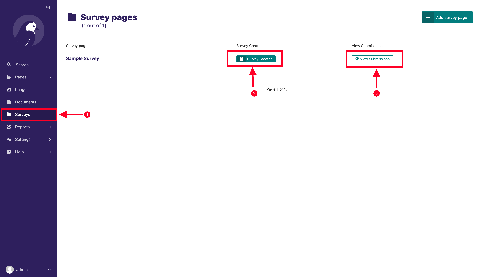

# Wagtail SurveyJs

Integrate Survey Js Forms into Wagtail Projects

# Features

[SurveyJS](https://surveyjs.io) is a set of JavaScript components that allow you and your users to build surveys,
quizzes, polls, and other web forms, store them in your database, and visualize survey results in custom dashboards.

This package enables to integrate most of the SurveyJS functionalities into Wagtail Projects

`Note`: If you need to create simple single-page forms, such as a `Contact us` form, you can use
the [Wagtail's Form Builder](https://docs.wagtail.org/en/latest/reference/contrib/forms/) module

### Implemented components

- [SurveyJS Form Library](https://surveyjs.io/form-library/documentation/overview) - create and integrate surveys into
  your application
- [Survey Creator](https://surveyjs.io/survey-creator/documentation/overview) - visual designer that enables to create
  and modify surveys and forms
- [SurveyJS Dashboard](https://surveyjs.io/dashboard/documentation/overview) - visualize survey results and allow users
  to analyze them

# Installation

Install with pip

```shell
pip install wagtail-surveyjs
```

Add` wagtailsurveyjs` to your installed apps. Make sure `wagtail.contrib.settings` is also added.

```python
 INSTALLED_APPS = [
    ...
    "wagtailsurveyjs",

    "wagtail.contrib.settings",
    ...
]
```

Run migrations

```shell
python manage.py migrate wagtailsurveyjs
```

Add the following to your project's `urls.py`

```python
urlpatterns = [
    ...
    path("", include("wagtailsurveyjs.urls")),
    ...
]
```

# Usage

### Settings

A Survey settings section will be added to the Settings section of the Wagtail Admin.



1. Click on`Settings` from Wagtail Admin sidebar
2. Click on `Survey settings`

You can check the `Has Survey JS Licence` option if you have purchased a Survey JS Licence. You can find more details
at [https://surveyjs.io/licensing](https://surveyjs.io/licensing)

### Creating a Survey Page

Below is a sample snippet on how to set up a Wagtail page that will render a survey form, created with the Survey JS
that will be created with teh integrated Survey Creator component.

```python
from wagtail.models import Page

from wagtailsurveyjs.models import AbstractSurveyJsFormPage


class HomePage(Page):
    pass


class SurveyPage(AbstractSurveyJsFormPage):
    parent_page_types = ['home.HomePage']

    subpage_types = []
    template = "survey_form_page.html"

    content_panels = Page.content_panels
```

Create your `template` as you could do for a usual wagtail page. We will configure it later for rendering A SurveyJS
form.

After running your migrations and adding the Page from the Wagtail Admin Explorer, the editor will look similar to the
screenshot below:



There is nothing much here to set up, unless you added more model fields to your Page.

`Publish` your page, and go back to the listing of your pages on the Wagtail Admin Explorer.

`NOTE`: Make sure you `Publish` the page before going to the survey creator. Saving as draft might give you issues where
your designed form fields might be lost on publishing later. So make sure you publish before designing the survey form.

Hover around the page title, and you will see a button named `Survey Creator` as below:



Clicking it will navigate to the Survey Creator interface, as below:



Here you can design your Survey form as needed. You can find an indepth guide on how to use the Survey Creator tool
at [https://surveyjs.io/survey-creator/documentation/end-user-guide](https://surveyjs.io/survey-creator/documentation/end-user-guide)

After you are satisfied with your form and how the questions look, you can click on `Done` to go back to the Survey
Page.

Now we need to show the form on the template, and our page should be ready.

We need to configure our template file a little before the form shows up. We need to include some styling and javascript

In your template file, add the following, assuming you are inheriting from `base.html`, as provided by the Wagtail
bootstrapped project files

```html





{{ block.super }}
<link href="" type="text/css" rel="stylesheet">



<h1>{{ page.title }}</h1>

<div>
    <div id="survey-form-container"></div>
</div>



{{ block.super }}
<script src=""></script>
<script src=""></script>




```

Here we include:

- The CSS files to style the survey js form. We use the default style `defaultV2.min.css`
- The Javascript files to load/show the Survey JS form
    - Jquery. If you have Jquery loaded from the `base.html`, you don't need to load it again
    - Survey.jquery.js - Survey JS Jquery library
    - Custom JS script to handle loading the form, and data submission
      with, ``
- The survey form container element, `<div id="survey-form-container"></div>`, where the form will be rendered. Note the
  default id that is expected is `survey-form-container`.

That is all that is needed to show a survey js form. You can view a complete example in the sample app `sandbox/home`.

If all went well, your survey with questions should be rendered:



Ofcourse you could style the page as you would do with any Wagtail/Django rendered page.

### Using a custom survey container element id

The default survey container element that the Js script looks for is `survey-form-container`.

To use a custom id other than the default `survey-form-container`, you can do the following:

- Create variable named `surveyContainerId` with the value being your custom container id, as in below snippet:

```html

<div>
    <div id="custom-id"></div>
</div>


{{ block.super }}
<script src=""></script>
<script src=""></script>

<script type="text/javascript">
    const surveyContainerId = "custom-id"
</script>



```

### Viewing results

Once you have published your page, shared it and started receiving submissions from your users, you can view results
dashboard by following the below steps.

- Navigate to where your Survey page is listed
- Hover to view the page buttons, click on `Survey Results` (similar to how you access the survey creator as explained
  above)
- The Survey JS results interface will be shown, as in the below screenshot



You can view the results in `Tabular format` or as an `interactive dashboard` with customizable visualizations and
charts.

You can use the `CSV` button to export as CSV format

### Quickly access Survey Pages and results

If you have a lot of Wagtail pages, navigating and finding the survey pages can be cumbersome.
Using [Wagtail Model Admin](https://docs.wagtail.org/en/stable/reference/contrib/modeladmin/index.html), you can
register a dedicated Menu item to the admin sidebar, to quickly access the pages and results.

Below are steps on how you can achieve this:

Add `wagtail.contrib.modeladmin` to `INSTALLED_APPS` if not yet added

```python
 INSTALLED_APPS = [
    ...
    "wagtailsurveyjs",

    "wagtail.contrib.settings",
    "wagtail.contrib.modeladmin",
    ...
]
```

In your apps' `wagtail_hooks.py` file add the following:

```python
from wagtail.contrib.modeladmin.options import modeladmin_register
from .models import SurveyPage  # your survejs page model
from wagtailsurveyjs.wagtail_hooks import BaseSurveyModelAdmin


class SurveyModelAdmin(BaseSurveyModelAdmin):
    model = SurveyPage
    menu_label = 'Surveys'
    menu_icon = 'folder-inverse'
    menu_order = 700


modeladmin_register(SurveyModelAdmin)

```

Restart your development server

A new menu item will be added to the Wagtail Admin sidebar as in below screenshot:



1. Click on the newly added menu item `Surveys`.
2. Link to access the `survey creator` for the page
3. Link to access the `results/dashboard`


